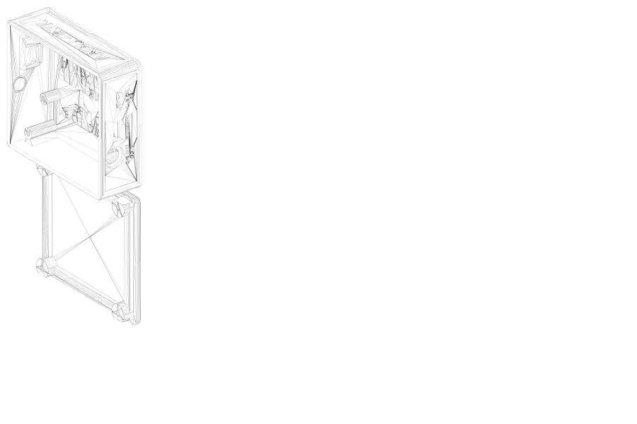
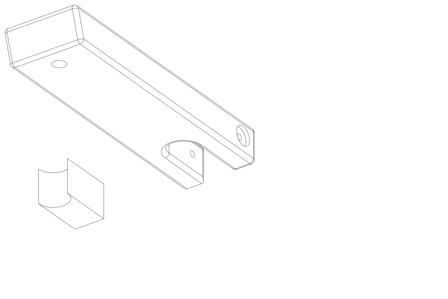
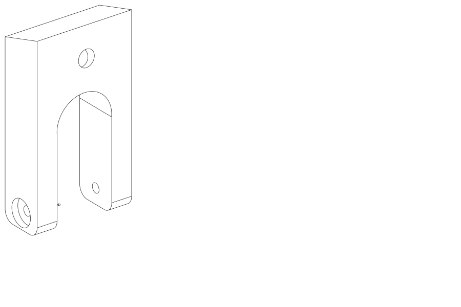

# Microsint

Estimation of **distance** and **relative angle** of vulnerable road users (pedestrians, bicycles, e-scooters) from 360° panoramic images, together with the **CAD** parts of the onboard GNSS and GoPro enclosure used for field data collection.

---

## Installation

```bash
conda create -n /Users/martin.dejaeghere/Downloads/top_piece.stepmicrosint python=3.11
conda activate microsint
pip install pandas scikit-learn joblib numpy
```

---

## CAD parts

Three STEP files describe the GNSS / video acquisition enclosure mounted on the mobile platform. These pieces are compatible with Segway-Ninebot F-series (F20–F40), D-series (D18–D38), and Xiaomi models (M365, 1S, Pro, Pro 2, Mi 3, Scooter 4), as well as other brands using a similar Ninebot/Xiaomi-type steering column design (e.g., Navee). 

| Part | File | Preview |
|---|---|---|
| GNSS box (cover + components) | [CAD_pieces/gnss_box.step](CAD_pieces/gnss_box.step) |  |
| Top piece | [CAD_pieces/top_piece.step](CAD_pieces/top_piece.step) |  |
| Bottom piece | [CAD_pieces/bottom_piece.step](CAD_pieces/bottom_piece.step) |  |

> `.step` files open in FreeCAD, Fusion 360, OnShape, SolidWorks, etc. 
---

## Repository layout

```
.
├── CAD_pieces/                    # 3D STEP models of the GNSS / GoPro enclosure
├── Bikes_relative_position/       # Distance/angle estimation — bicycles
├── Escooter_relative_position/    # Distance/angle estimation — e-scooters
└── Pedestrian_relative_position/  # Distance/angle estimation — pedestrians
    └── Experiment_FUSE/           # Merged training/test dataset
```

Each *relative_position* folder contains:
- a `*_model_developpment.ipynb` notebook — model development and training;
- a `*_distance.py` script — inference API `get_ang_dist_<class>(c_x, c_y)`;
- two `joblib` models: `distance_predictor_small` (short range) and `distance_predictor_big` (long range);
- an angle model `angle_predictor*`;
- training/validation data (`*_data.csv`, `validation/`).

---

## How it works

The source panoramic image is **5376 px wide** (360°). For each detected user, its pixel position `(c_x, c_y)` in the image is fed to the pipeline, which returns:

- **relative angle** with respect to the vehicle's heading (`-180°` … `+180°`),
- **distance** in mm (automatic switch between a *short-range* and *long-range* model at a ~1 m threshold).

The image is split into segments (4 for bikes/e-scooters, 8 for pedestrians) to linearize the regression and handle front/back/left/right symmetries.

```python
from Bikes_relative_position.bike_distance import get_ang_dist_bike

angle_deg, dist_mm = get_ang_dist_bike(c_x=1200, c_y=850)
```


## License

Research use — please contact the author [martin.dejaeghere@entpe.fr](mailto:martin.dejaeghere@entpe.fr) for any reuse.
